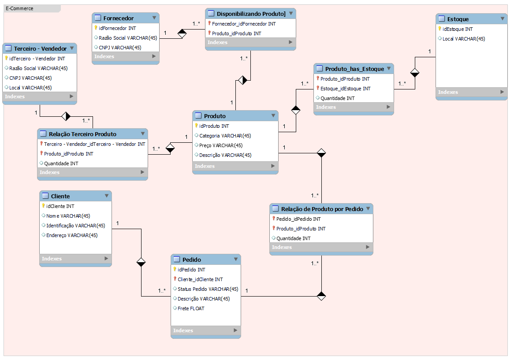
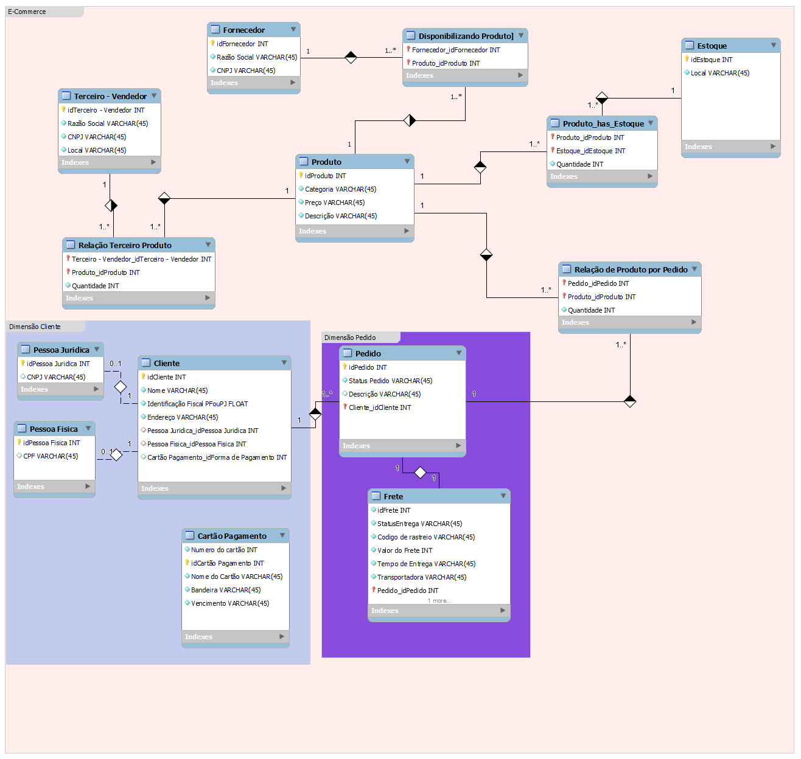

<h1>Refinamento de modelagem de Dados</h1>

Entregando atividade, com os refinamentos solicitados:

* Cliente PJ e PF – Uma conta pode ser PJ ou PF, mas não pode ter as duas informações;
* Pagamento – Pode ter cadastrado mais de uma forma de pagamento;
* Entrega – Possui status e código de rastreio;

<h1>Antes</h1>

<h1>Depois</h1>

